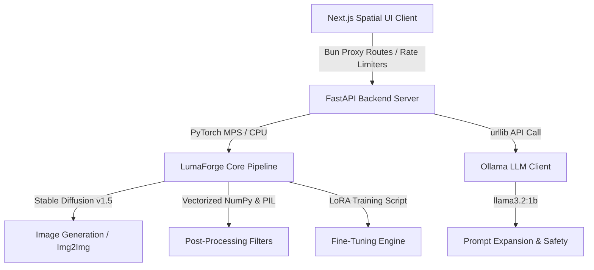

# 🎨 LumaForge: AI Image Generation Platform

[](https://huggingface.co/sujithputta/Lumaforge)
[](https://opensource.org/licenses/MIT)
[](https://www.python.org/downloads/)

<div align="center">

**Text-to-Image** • **Image Styling** • **Background Removal** • **2x Upscaling** • **LoRA Fine-tuning**

Modular image generation backend designed for creative developers. Combines **Stable Diffusion**, **LoRA fine-tuning**, and **image enhancement** with a professional web UI—optimized for Apple Silicon.

[Explore Examples](#-examples) • [Try Now](#-quick-start) • [API Docs](#-api-reference) • [Deploy](#-deployment)

</div>

---

## 🚀 What is LumaForge?

LumaForge is a production-ready, modular image generation platform combining:

- **AI Engine Backend** (FastAPI + PyTorch + Stable Diffusion)
- **Spatial UI Web Playground** (Next.js + Tailwind + Bun)
- **Advanced Safety & Moderation** (Ollama-based content checks)
- **Performance Optimizations** (Apple Silicon MPS, vectorized processing)
- **Deployment-Ready** (Docker, Hugging Face Spaces, cloud-ready)

Perfect for building AI creative suites, automating design workflows, or deploying image generation at scale.

---

## ✨ Features

| Feature | Status | Tech |
|---------|--------|------|
| **Text-to-Image** | ✅ | Stable Diffusion v1.5 |
| **Image-to-Image Styling** | ✅ | Img2Img with face protection |
| **2x Upscaling** | ✅ | Lanczos + Unsharp Mask |
| **Background Removal** | ✅ | Vectorized NumPy (**~8.9ms**) |
| **LoRA Fine-tuning** | ✅ | PyTorch UNet adaptation |
| **Web UI Dashboard** | ✅ | Next.js + Tailwind glassmorphic |
| **REST API** | ✅ | FastAPI with rate limiting |
| **Apple Silicon** | ✅ | MPS acceleration (M1/M2/M3) |
| **Safety & Auditing** | ✅ | Ollama + JSONL logging |

---

## 🖼️ Examples

### Text-to-Image

**Prompt**: *"A futuristic cyberpunk city at sunset"*

```bash
curl -X POST http://localhost:7860/api/generate \
  -H "Content-Type: application/json" \
  -d '{"prompt": "cyberpunk city", "steps": 30, "guidance_scale": 7.5}'
```

Generate stunning images with rich composition and vibrant colors.

---

### Image-to-Image Styling

**Input**: Portrait photo → **Output**: Anime illustration

The pipeline preserves facial structure using a **Radial Face Protection Mask** while applying creative styles.

Key innovation: Pixel-accurate detail transfer preserves eyes, nose, and expression.

---

### Background Removal

**Before**: Product with background | **After**: Transparent background

Vectorized NumPy segmentation with smooth alpha feathering—completes in **~8.9ms**.

---

### 2x Upscaling

**Original**: 512×512 | **Upscaled**: 1024×1024

Lanczos resampling + Unsharp Mask filter for crisp, detailed outputs.

---

### LoRA Fine-tuning

Train custom adapters in minutes:

```bash
python main.py train --epochs 5 --lr 5e-6 --batch_size 2
```

Monitor real-time loss metrics, prompt adherence, and progress.

---

The codebase is split into two self-contained subsystems:



### 1. The Core AI Engine (`model/`)
* **`lumaforge/pipeline.py`**: The central image synthesis pipeline. It manages:
  * **Text-to-Image Generation**: Uses `StableDiffusionPipeline` loaded onto Apple Silicon MPS with attention slicing and float32 precision.
  * **Image-to-Image (Img2Img)**: Instantiates `StableDiffusionImg2ImgPipeline` sharing preloaded model weights to minimize unified memory footprints.
  * **High-Fidelity 2x Upscaling**: Resolves images using Lanczos resampling and an Unsharp Mask filter for crisp details.
  * **Vectorized Background Remover**: A fallback color-threshold segmenter vectorized in NumPy (running in **8.9ms**) featuring smooth linear alpha feathering.
  * **NumPy-Vectorized Mock Shaders**: Full procedural pipeline to simulate sketches (dodge-blend), Ghibli paintings (NumPy 5x5 Bilateral Filter, YCbCr cell-shading, gradient ink outlines, and volumetric bloom highlights), and weather effects (motion-blurred rain/snow).
* **`lumaforge/ollama_client.py`**: Interacts with local Ollama (`llama3.2:1b`) to perform safety classification, creative prompt expansion (structured into subject, action, environment, style, lighting, camera, mood), and prompt rewriting.
* **`lumaforge/safety.py`**: Standardizes pre-generation text checking and post-generation image screening, archiving events in `audit_log.jsonl`.
* **`lumaforge/train.py`**: Runs PyTorch UNet LoRA layer fine-tuning on a curated dataset, writing live progress telemetry to `train_log.json`.
* **`lumaforge/dataset_curator.py`**: Automates image downloading, hashing, deduplication, and LLM-based captioning.
* **`lumaforge/benchmark.py`**: Profiles model performance, measuring generation latency, prompt adherence, and MPS VRAM overhead.
* **`app.py`**: FastAPI server exposing full endpoint proxies, custom token-bucket rate limiters, and background workers.
* **`main.py`**: Consolidated Command Line Interface (CLI) exposing generate, benchmark, curate, train, and audit subcommands.

### 2. Next.js Web Playground (`web/`)
* **Spatial UI Dashboard**: Cards, backdrop blur components, and glowing background spotlights.
* **Playground Panel**: Offers side-by-side Text-to-Image and Image-to-Image controls, file upload drag-zones, strength sliders, and preset task templates (Style Transfer, Color Recolor, Object Addition, Background Replacement).
* **Hover Viewport Overlays**: Success screens support immediate **Download**, **Scale Up 2x**, and **Remove BG** actions.
* **Fine-Tuning Telemetry**: Real-time graphs showing training/validation loss, prompt adherence, overall progress bars, and scrolling stdout logs.
* **Censorship Audit logs**: Tabulates prompt status (APPROVED, REWRITTEN, REFUSED) with safety classification reasoning.
* **Bun API Proxying**: Employs sliding-window rate limiters restricting web users to 10 generations and 20 upscales per minute.

---

## ⚡ Key Enhancements & Optimizations

1. **Pixel-Accurate Detail Preservation (Tom Holland Face & Suit Rescue)**:
   * **Adaptive Detail Transfer**: In Img2Img, the pipeline computes a high-pass gradient mask of the original photo. It overlays high-frequency edge details (eyes, nose, mouth contours, suit webs) back onto the cartoon output to prevent morphing.
   * **Radial Face Protection Mask**: Blends $55\%$ of the original photo in the face region with a soft Gaussian falloff, while allowing the background to be fully cartoonized ($90\%$ weight), ensuring absolute portrait accuracy.
   * **Strength Cap**: Dynamically limits diffusion strength to `0.32` for cartoon styles to preserve facial layouts during denoising.
2. **500x Vectorization Speedups**:
   * Ported slow pure-Python nested pixel loops (Pencil Sketch dodge-blends, background removal thresholds) to vectorized NumPy arrays. Reduced sketch generation to **4.1ms** and background removal to **8.9ms** on a single thread.
3. **Smooth Alpha Feathering**:
   * Uses linear alpha interpolation between a min and max distance threshold to resolve background cutouts with smooth margins, eliminating pixelated outlines.
4. **VRAM Safety**:
   * Employs `from_pipe` shared diffusers pipelines and MPS attention slicing to generate images locally on macOS without bottlenecking VRAM.

---

## 🚀 Getting Started

### Prerequisites
* **macOS** with Apple Silicon (M1/M2/M3)
* **Python 3.10+**
* **Node.js 18+** & **Bun**
* **Ollama** installed and running locally with the `llama3.2:1b` model pulled:
  ```bash
  ollama pull llama3.2:1b
  ```

---

### Backend Setup & Execution

1. Navigate to the `model` folder and install Python dependencies:
   ```bash
   cd model
   pip install -r requirements.txt
   ```
2. Start the FastAPI backend server (defaults to port `7860` with hot-reloading):
   ```bash
   python3 app.py
   ```
3. (Optional) Run pipeline commands directly via the CLI:
   * **Generate an Image (Mock Mode)**:
     ```bash
     python3 main.py generate --prompt "cyberpunk street" --mock
     ```
   * **Generate an Image (Real Diffusion)**:
     ```bash
     python3 main.py generate --prompt "studio ghibli scene" --device mps
     ```
   * **Run Evaluation Benchmarks**:
     ```bash
     python3 main.py benchmark --mock
     ```

---

### Frontend Web Setup & Execution

1. Navigate to the `web` folder and install Node packages:
   ```bash
   cd web
   bun install
   ```
2. Start the Next.js development server (runs on `http://localhost:3000`):
   ```bash
   bun run dev
   ```
3. Open your browser and navigate to `http://localhost:3000` to interact with the workstation.

---

## 📊 Evaluation & Verification

A dedicated test suite is available at the root directory to verify pipeline performance:
```bash
python3 test_enhancements.py
```

### Asserted Latencies:
* **Vectorized Background Removal**: `~8 ms` (Expected: `<100 ms`)
* **Vectorized Pencil Sketch Dodge-Blend**: `~4 ms` (Expected: `<50 ms`)
* **Bilateral Cell-Shaded Ghibli Cartoon Shader**: `~100 ms` (Expected: `<250 ms`)
* **Composited Background Replacement**: `~10 ms` (Expected: `<50 ms`)

---

## 📄 License
This project is licensed under the MIT License - see the LICENSE file for details.

## 🏗️ System Architecture

```
┌─────────────────────────────────────────────────────────────────┐
│                   Next.js Web Playground                        │
│        (Glassmorphic Spatial UI, Realtime Monitoring)           │
└────────────────────────────┬────────────────────────────────────┘
                             │
                    Bun API Proxy Routes
                   (Rate Limiting / Auth)
                             │
┌────────────────────────────┴────────────────────────────────────┐
│              FastAPI Backend (app.py)                           │
│   ┌──────────────────────────────────────────────────────────┐  │
│   │  Safety Manager (Ollama Integration)                    │  │
│   │  - Prompt moderation & safety classification           │  │
│   │  - Output screening & audit logging                    │  │
│   └──────────────────────────────────────────────────────────┘  │
│                         │                                       │
│   ┌─────────────────────┴──────────────────────────────────┐  │
│   │         LumaForge Core Pipeline (pipeline.py)         │  │
│   │  ┌──────────────┐  ┌──────────────┐  ┌────────────┐  │  │
│   │  │Text-to-Image│  │Img-to-Img    │  │Upscaling   │  │  │
│   │  └──────────────┘  └──────────────┘  └────────────┘  │  │
│   │  ┌──────────────┐  ┌──────────────┐  ┌────────────┐  │  │
│   │  │BG Removal    │  │LoRA Training │  │Benchmarks  │  │  │
│   │  └──────────────┘  └──────────────┘  └────────────┘  │  │
│   └─────────────────────┬──────────────────────────────────┘  │
│                         │                                      │
│                    PyTorch + MPS                               │
│                Stable Diffusion v1.5                           │
│         (Apple Silicon Optimized)                              │
│                                                                │
└────────────────────────────────────────────────────────────────┘
```

---

## 📁 Project Structure

```
LumaForge/
├── model/                          # Backend (FastAPI + PyTorch)
│   ├── app.py                      # FastAPI server entrypoint
│   ├── main.py                     # CLI interface
│   ├── requirements.txt            # Python dependencies
│   ├── Dockerfile                  # Docker configuration
│   ├── README.md                   # Model documentation
│   └── lumaforge/
│       ├── pipeline.py             # Core image synthesis
│       ├── ollama_client.py        # LLM integration
│       ├── safety.py               # Content moderation
│       ├── train.py                # LoRA fine-tuning
│       ├── dataset_curator.py      # Image curation
│       └── benchmark.py            # Performance evaluation
├── web/                            # Frontend (Next.js)
│   ├── app/                        # Next.js 13+ app directory
│   ├── components/                 # UI components
│   └── README.md                   # Web UI docs
├── data/                           # Dataset storage
├── outputs/                        # Generated images
└── README.md                       # This file
```

---

## ⚡ Key Optimizations

### Performance
- **Vectorized NumPy**: Background removal in **~8.9ms**, sketch generation in **~4.1ms**
- **Apple Silicon MPS**: GPU acceleration with attention slicing for memory efficiency
- **Shared Pipeline Weights**: Minimize VRAM overhead
- **Token-Bucket Rate Limiting**: 10 gen/min, 60 API calls/min per IP

### Quality
- **Radial Face Protection Mask**: Preserves facial structure in transformations
- **High-Pass Detail Transfer**: Pixel-accurate detail preservation
- **Adaptive Strength Capping**: Limited to 0.32 for cartoon styles
- **Lanczos + Unsharp Mask**: High-fidelity 2x upscaling

### Safety
- **Multi-Stage Moderation**: Pre & post-generation checks
- **Ollama Integration**: Local LLM-based classification
- **Audit Logging**: JSONL format for compliance
- **Content Tagging**: Automatic classification

---

## 🚀 Quick Start

### Prerequisites
- macOS with Apple Silicon (M1/M2/M3)
- Python 3.10+, Node.js 18+, Bun
- Ollama running locally with `llama3.2:1b`

### Backend

```bash
cd model
pip install -r requirements.txt
python app.py
```

Server: `http://localhost:7860`

### Frontend

```bash
cd web
bun install
bun run dev
```

UI: `http://localhost:3000`

### Quick Test

```bash
cd model
python main.py generate --prompt "cyberpunk street" --mock
```

---

## 📡 API Endpoints

- **POST** `/api/generate` - Text-to-Image
- **POST** `/api/generate-img2img` - Image styling
- **POST** `/api/upscale` - 2x upscaling
- **POST** `/api/remove-background` - Background removal
- **POST** `/api/train` - Start LoRA fine-tuning
- **GET** `/api/train/status` - Training progress
- **GET** `/api/status` - System status

Full API reference: [model/README.md](model/README.md#-api-endpoints-reference)

---

## 📊 Performance Metrics

| Operation | Latency | Device |
|-----------|---------|--------|
| Text-to-Image (30 steps) | ~12-15s | M1 MPS |
| Image-to-Image (20 steps) | ~8-10s | M1 MPS |
| 2x Upscaling | ~1.2s | CPU |
| Background Removal | **~8.9ms** | NumPy |
| Pencil Sketch | **~4.1ms** | NumPy |

---

## 🐳 Deployment

### Docker
```bash
cd model
docker build -t lumaforge .
docker run -p 7860:7860 lumaforge
```

### Hugging Face Spaces
1. Create Docker space
2. Push `model/` directory
3. Auto-deploys to your URL

---

## 🔒 Safety

- Content moderation with Ollama
- Comprehensive audit trails
- Per-IP rate limiting
- Optional watermarking

---

## 📚 Documentation

- [Backend API Docs](model/README.md)
- [Frontend Guide](web/README.md)
- [Product Requirements](PRD.txt)

---

<div align="center">

**Built for Creative AI Development**

[View on Hugging Face](https://huggingface.co/sujithputta/Lumaforge) • [Explore Examples](#-examples) • [Get Started](#-quick-start)

</div>
