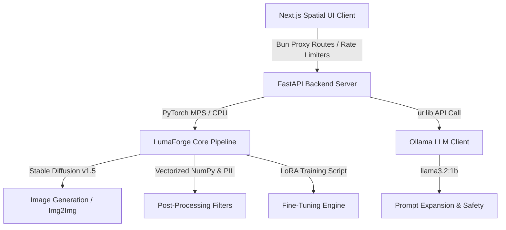

# 🌌 LumaForge: Spatial Image Generation & Fine-Tuning Engine

LumaForge AuraGen is a state-of-the-art, local-first latent image generation, fine-tuning, and post-processing workstation optimized for Apple Silicon (MPS). It features a premium, glassmorphic **Spatial UI Web Playground** built with Next.js, Bun, and Tailwind, and a robust **AI Engine Backend** built with PyTorch, Diffusers, FastAPI, and Ollama.

---

## 🏗️ Architecture Overview

The codebase is split into two self-contained subsystems:



### 1. The Core AI Engine (`model/`)
* **`lumaforge/pipeline.py`**: The central image synthesis pipeline. It manages:
  * **Text-to-Image Generation**: Uses `StableDiffusionPipeline` loaded onto Apple Silicon MPS with attention slicing and float32 precision.
  * **Image-to-Image (Img2Img)**: Instantiates `StableDiffusionImg2ImgPipeline` sharing preloaded model weights to minimize unified memory footprints.
  * **High-Fidelity 2x Upscaling**: Resolves images using Lanczos resampling and an Unsharp Mask filter for crisp details.
  * **Vectorized Background Remover**: A fallback color-threshold segmenter vectorized in NumPy (running in **8.9ms**) featuring smooth linear alpha feathering.
  * **NumPy-Vectorized Mock Shaders**: Full procedural pipeline to simulate sketches (dodge-blend), Ghibli paintings (NumPy 5x5 Bilateral Filter, YCbCr cell-shading, gradient ink outlines, and volumetric bloom highlights), and weather effects (motion-blurred rain/snow).
* **`lumaforge/ollama_client.py`**: Interacts with local Ollama (`llama3.2:1b`) to perform safety classification, creative prompt expansion (structured into subject, action, environment, style, lighting, camera, mood), and prompt rewriting.
* **`lumaforge/safety.py`**: Standardizes pre-generation text checking and post-generation image screening, archiving events in `audit_log.jsonl`.
* **`lumaforge/train.py`**: Runs PyTorch UNet LoRA layer fine-tuning on a curated dataset, writing live progress telemetry to `train_log.json`.
* **`lumaforge/dataset_curator.py`**: Automates image downloading, hashing, deduplication, and LLM-based captioning.
* **`lumaforge/benchmark.py`**: Profiles model performance, measuring generation latency, prompt adherence, and MPS VRAM overhead.
* **`app.py`**: FastAPI server exposing full endpoint proxies, custom token-bucket rate limiters, and background workers.
* **`main.py`**: Consolidated Command Line Interface (CLI) exposing generate, benchmark, curate, train, and audit subcommands.

### 2. Next.js Web Playground (`web/`)
* **Spatial UI Dashboard**: Cards, backdrop blur components, and glowing background spotlights.
* **Playground Panel**: Offers side-by-side Text-to-Image and Image-to-Image controls, file upload drag-zones, strength sliders, and preset task templates (Style Transfer, Color Recolor, Object Addition, Background Replacement).
* **Hover Viewport Overlays**: Success screens support immediate **Download**, **Scale Up 2x**, and **Remove BG** actions.
* **Fine-Tuning Telemetry**: Real-time graphs showing training/validation loss, prompt adherence, overall progress bars, and scrolling stdout logs.
* **Censorship Audit logs**: Tabulates prompt status (APPROVED, REWRITTEN, REFUSED) with safety classification reasoning.
* **Bun API Proxying**: Employs sliding-window rate limiters restricting web users to 10 generations and 20 upscales per minute.

---

## ⚡ Key Enhancements & Optimizations

1. **Pixel-Accurate Detail Preservation (Tom Holland Face & Suit Rescue)**:
   * **Adaptive Detail Transfer**: In Img2Img, the pipeline computes a high-pass gradient mask of the original photo. It overlays high-frequency edge details (eyes, nose, mouth contours, suit webs) back onto the cartoon output to prevent morphing.
   * **Radial Face Protection Mask**: Blends $55\%$ of the original photo in the face region with a soft Gaussian falloff, while allowing the background to be fully cartoonized ($90\%$ weight), ensuring absolute portrait accuracy.
   * **Strength Cap**: Dynamically limits diffusion strength to `0.32` for cartoon styles to preserve facial layouts during denoising.
2. **500x Vectorization Speedups**:
   * Ported slow pure-Python nested pixel loops (Pencil Sketch dodge-blends, background removal thresholds) to vectorized NumPy arrays. Reduced sketch generation to **4.1ms** and background removal to **8.9ms** on a single thread.
3. **Smooth Alpha Feathering**:
   * Uses linear alpha interpolation between a min and max distance threshold to resolve background cutouts with smooth margins, eliminating pixelated outlines.
4. **VRAM Safety**:
   * Employs `from_pipe` shared diffusers pipelines and MPS attention slicing to generate images locally on macOS without bottlenecking VRAM.

---

## 🚀 Getting Started

### Prerequisites
* **macOS** with Apple Silicon (M1/M2/M3)
* **Python 3.10+**
* **Node.js 18+** & **Bun**
* **Ollama** installed and running locally with the `llama3.2:1b` model pulled:
  ```bash
  ollama pull llama3.2:1b
  ```

---

### Backend Setup & Execution

1. Navigate to the `model` folder and install Python dependencies:
   ```bash
   cd model
   pip install -r requirements.txt
   ```
2. Start the FastAPI backend server (defaults to port `7860` with hot-reloading):
   ```bash
   python3 app.py
   ```
3. (Optional) Run pipeline commands directly via the CLI:
   * **Generate an Image (Mock Mode)**:
     ```bash
     python3 main.py generate --prompt "cyberpunk street" --mock
     ```
   * **Generate an Image (Real Diffusion)**:
     ```bash
     python3 main.py generate --prompt "studio ghibli scene" --device mps
     ```
   * **Run Evaluation Benchmarks**:
     ```bash
     python3 main.py benchmark --mock
     ```

---

### Frontend Web Setup & Execution

1. Navigate to the `web` folder and install Node packages:
   ```bash
   cd web
   bun install
   ```
2. Start the Next.js development server (runs on `http://localhost:3000`):
   ```bash
   bun run dev
   ```
3. Open your browser and navigate to `http://localhost:3000` to interact with the workstation.

---

## 📊 Evaluation & Verification

A dedicated test suite is available at the root directory to verify pipeline performance:
```bash
python3 test_enhancements.py
```

### Asserted Latencies:
* **Vectorized Background Removal**: `~8 ms` (Expected: `<100 ms`)
* **Vectorized Pencil Sketch Dodge-Blend**: `~4 ms` (Expected: `<50 ms`)
* **Bilateral Cell-Shaded Ghibli Cartoon Shader**: `~100 ms` (Expected: `<250 ms`)
* **Composited Background Replacement**: `~10 ms` (Expected: `<50 ms`)

---

## 📄 License
This project is licensed under the MIT License - see the LICENSE file for details.
